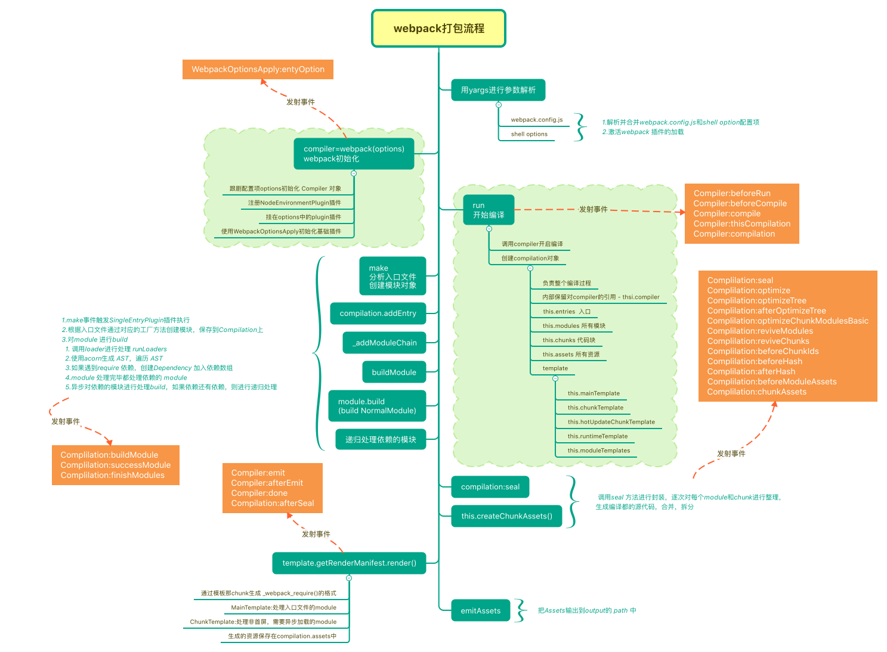

# webpack 插件原理简述

webpack 插件机制就是发布订阅模式，大体的方式就是：

1. 创建：首先在内部对象上的`hooks`对象上创建相应的钩子

   - 创建`compilation`钩子，[compiler.hooks](./webpack-source/webpack/lib/Compiler.js)line:66

1. 监听：然后再适当的时机将自己的方法注册到钩子，等待 webpack 调用
   - 监听`compilation`钩子， [compiler.hooks.compilation.tap](./webpack-source/webpack/lib/SingleEntryPlugin.js) line:30
1. 触发：webpack 在编译的过程中，调用对于的钩子
   - 触发`compilation`钩子 [compiler.hooks.compilation.call](./webpack-source/webpack/lib/webpack.js) line:631

## tapable

webpack 的插件都是基于`tapable`实现的

## tapable 的类型

- 同步`sync`
- 异步`async`
  - 并行`series`
  - 串行`parallel`

| 类型 | 说明 |
| --- | --- |
| Basic | 不关心监听函数的返回值 |
| Bail | 监听的函数有返回值则不会再调用后续的监听函数 |
| Waterfall | 上一个监听函数的返回值会交给下一个监听函数 |
| Loop | 如果监听函数返回`true`则这个监听函数会反复执行，直到返回 undefined |

## AsyncSeriesHook

> 异步并行钩子，根据注册函数顺序依次调用，不关心监听函数的返回值

- [实现](./tapable/AsyncSeriesHook.js)
- [测试用例](./test/AsyncSeriesHook.js)

## AsyncSeriesWaterfallHook

> 异步并行瀑布流钩子，根据注册函数顺序依次调用，上一个监听函数的返回值会作为下一个监听函数的入参

- [实现](./tapable/AsyncSeriesWaterfallHook.js)
- [测试用例](./test/AsyncSeriesWaterfallHook.js)

## 流程

[钩子执行流程](./flow.md)

## stats 对象

> 调用 `compiler.run`的回调函数能拿到一个[stats](./stats.json)对象，里面存放了整个编译过程的所有的信息，比较常用的有如下三个：

| 字段    | 含义                   |
| ------- | ---------------------- |
| modules | 记录了所有解析后的模块 |
| chunks  | 记录了所有 chunk       |
| assets  | 记录了所有要生成的文件 |

### 参考

[webpack4.0 源码分析之 Tapable](https://juejin.im/post/5abf33f16fb9a028e46ec352)
